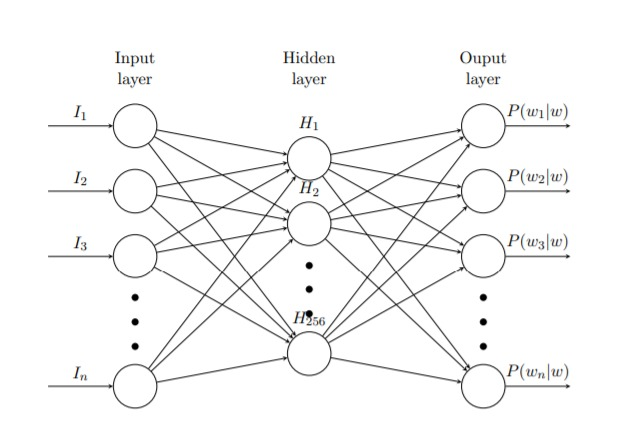
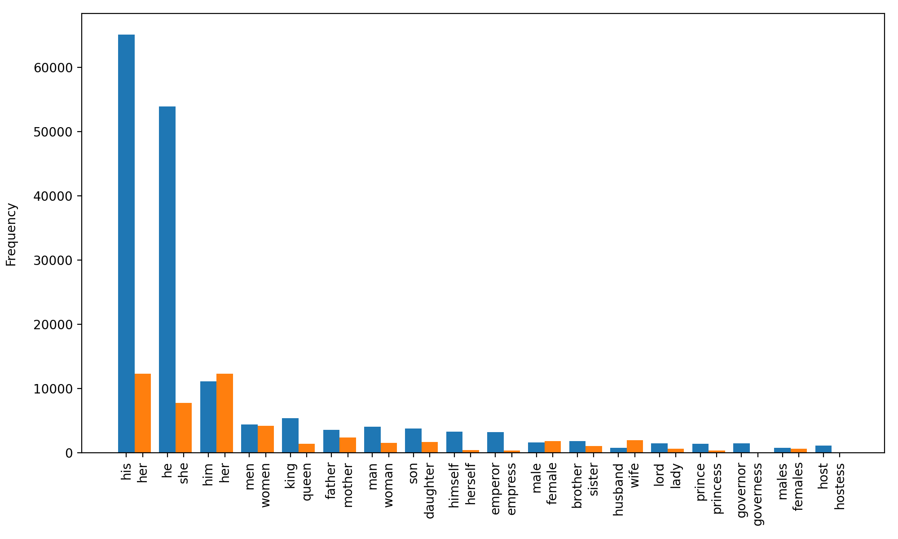
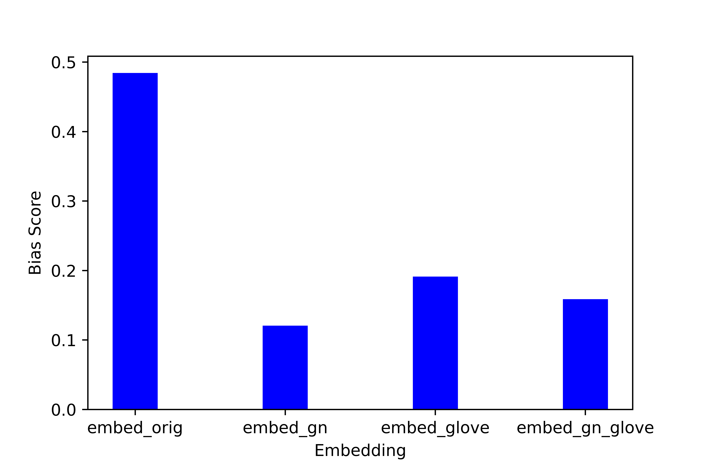
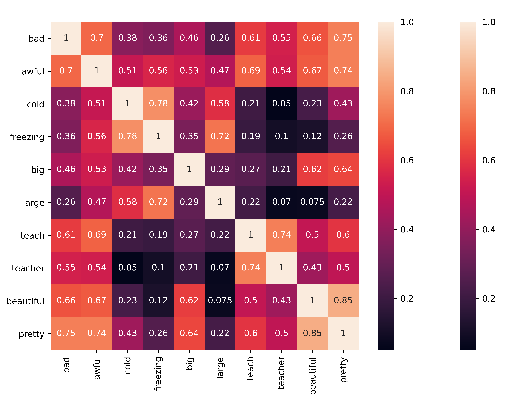

# Gender-Neutral-Embedding-Generator
This repo is a implmentation of a NLP course project which uses a data augmentation technique to generate gender neutral embeddings.  

# General Overview
In paper [[1]](#1), the author modify the source data to make it gender netural by swapping male and female entities. The final model is trained on the union of original and augmented data. Inspiration has also been taken from paper [[2]](#2) to generate word2vec representation. Final embeddings are found to be more gender neutral as compared to both [Glove](https://nlp.stanford.edu/projects/glove/) and [gn-Glove](https://github.com/uclanlp/gn_glove).

# Model
Used word2vec skip-gram method of generating embeddings on the original data and gender neutral data. The word2vec model has the following specifications:

1. Firstly built a vocabulary containing words with frequency greater than 20.
2. Used one representation for each word and use 1 hidden layer based neural network to train
the model where size of hidden layer is equal to the embedding size. Output of this network is a
vector of size = vocab size and uses softmax classifier.
3. Now, For a word, say x, output[i] represent the probability that ith word in the vocabulary is a nearby
word of x. A window size of 5 is used for defining a word as nearby word.
4. The hidden layer weight matrix of size (vocab-size*embedding-size) finally generated contains
embedding corresponding to each word.

The figure below illustrates the architecture of the neural network used. Here, n represent the vocabulary size, whereas P(wi|w) is the probability that 
ith word of the vocabulary is a nearby word for some word w. While we can use the above model for training embedding, it is incredibly slow because of the
size of weight matrix to be generated. Hence, techniques like sub-sampling frequent words and modifying objective function using Negative Sampling as mentioned in the paper[[2]](#2) has been used.

[Code](./main/word2vec.ipynb)

# Dataset
Wikipedia  text  corpus  has  been  used  to  generate  the  dataset  used  for  training.    Latest  English Wikipedia  articles  were  downloaded  from  [Wikidumps](https://dumps.wikimedia.org/).   These  articles  were  parsed  into  sentences and normalized, by lowering the case, removing special characters and numbers.  These normalization steps are necessary for effective training of the embeddings.  5,00,000 sentences were used for training purposes.  Analysis on the corpus showed that female entities were significantly under-represented in the dataset.  The frequency of male-gendered words in the dataset is 1,95,419, while the frequency of female-gendered words is only 58,682.

Augmented  dataset  was  generated  by  swapping  male  words  like  he/him  with  female  words  like she/her and vice versa.  Gender specific wordlist used for swapping has been curated from [this GitHub repo](https://github.com/ranjita-naik/Gender_Swapping/tree/main/swaps) and some other publicaly available sources.  The list consists of 260 word pairs.  In total 2,54,101 gender words were swapped to generate the augmenteddataset.  
[Code](./main/Data_Pre_Processing.ipynb)

# Results
Bias comparison method mentioned in [[3]](#3) has been used for making comparison between embeddings. 

[Code](./main/Result.ipynb)

# Error Analysis
Following is a representation of cosine similarity of some of the handpicked words. Pairs like (beautiful,pretty) have high similarity as expected but there are some deviations like (big, large). These errors are mainly due to relatively small dataset. 

[Code](./main/analysis.ipynb)

# Limitations
1. A simple substitution of gender specific words sometimes result in sentences which are not applicable to the real world.  For eg. For the sentence, “She gave birth.”,  swapping gender identifying word results in “He gave birth”, which is absurd.

## References
<a id="1">[1]</a> 
 J. Zhao, T. Wang, M. Yatskar, V. Ordonez, and K. Chang, “Gender bias in coreference resolution:Evaluation and debiasing methods,”CoRR, vol. abs/1804.06876, 2018.
 
<a id="2">[2]</a> 
 T. Mikolov, I. Sutskever, K. Chen, G. Corrado, and J. Dean, “Distributed representations of wordsand phrases and their compositionality,”arXiv preprint arXiv:1310.4546, 2013
 
<a id="3">[3]</a> 
 T. Bolukbasi, K.-W. Chang, J. Zou, V. Saligrama, and A. Kalai, “Man is to computer programmer as woman is to homemaker? debiasing word embeddings,” arXiv preprint arXiv:1607.06520, 2016. 
 
